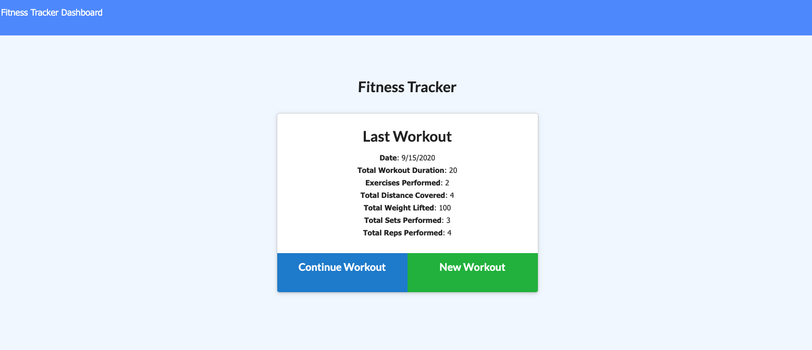
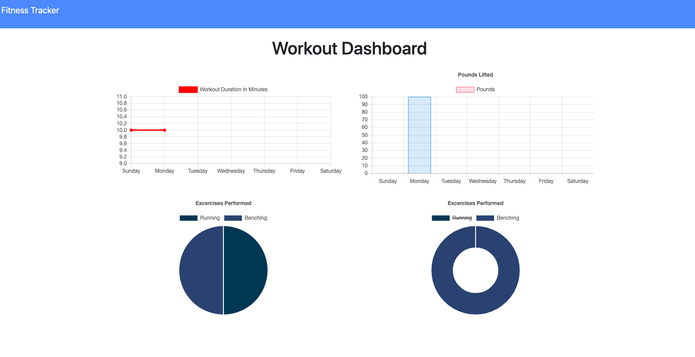

# Fitness Tracker 
 
### Description 
 A friendly application to keep track to keep track of your workout performance and view statistics. 
### Table of Contents 
- [**Description**](#Description) 
- [**Installation**](#Installation) 
- [**Usage**](#Usage) 
- [**License**](#License) 
- [**Contributing**](#Contributing) 
- [**Tests**](#Tests) 
- [**Questions**](#Questions)
### Deployment 
 View the deployed app at https://shrouded-scrubland-43677.herokuapp.com/?id=5f6175c026228c0017bb4f4a. 
### Usage 
 NA 
### License 
This project is covered under the MIT license. 
### Contributing 
 NA 
### Tests 
 NA 
### Questions 

For additional projects and materials, go to ***[github.com/sassypigeon](https://github.com/sassypigeon)***. 
For additional questions, email me at ***mitchellmunderwood@gmail.com*** 

### Images

 

